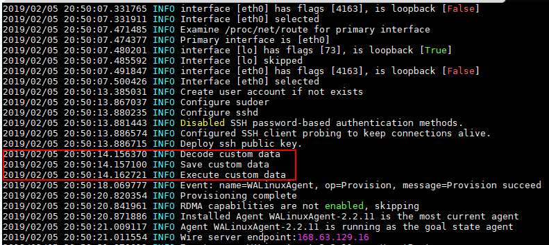
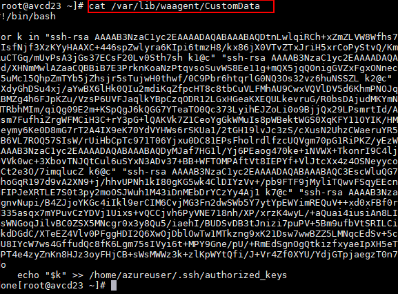
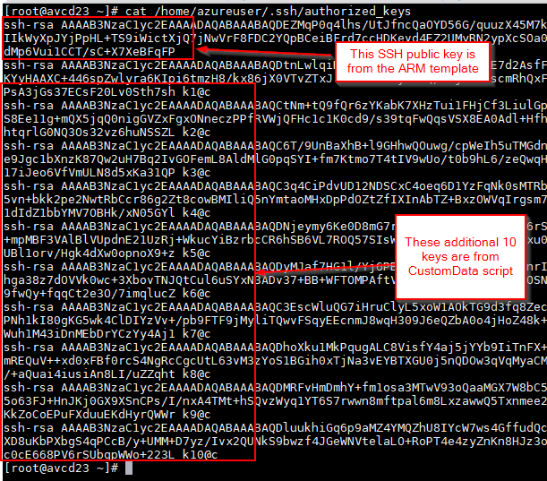

# Using VM CustomData to pass in multiple SSH public keys

Prior to creating the VM image, update the /etc/waagent.conf file to set the following parameters to "y"
```
sed -i 's/Provisioning.DecodeCustomData=n/Provisioning.DecodeCustomData=y/g' /etc/waagent.conf
sed -i 's/Provisioning.ExecuteCustomData=n/Provisioning.ExecuteCustomData=y/g' /etc/waagent.conf
```

Set sshPublicKey parameter to an SSH public key which is required for VM provisioning. However, if you do not want to use this static public key to be able to access the VMs in the future, you can delete its private key.

Set customData (max length 64KB) ARM template parameter to string value with a Bash script like the following. You will need to replace the USERNAME string with the adminUsername value that you are using when provisioning the VM. 
```
#!/bin/bash

for k in "key1" "key2" "key3" "key4" "key5" "key6" "key7" "key8" "key9" "key10"
do
    echo "$k" >> /home/USERNAME/.ssh/authorized_keys
done
```

CustomData is executed by Linux Agent before extensions (CustomData is not executed on Ubuntu/CoreOS or when using cloud-init)

Troubleshooting
* /var/log/waagent.log
* /var/lib/waagent/CustomData
* Script failure does not cause a VM provisioning failure
* Script execution time does impact VM provisioning time (max of 40 minutes)

Create resource group
```
az group create -n avcd1 -l eastus2
```

Deploy template with customdata-script-example.sh containing sample script to run with sample SSH public keys (do NOT use these exact keys, they are just for testing)
```
az group deployment create -g avcd1 --template-file create-vm-with-customdata.json --parameters customData=@customdata-script-example.sh
```

After VM provisions, you can review the following items to double-check that keys were set as expected.

Linux Azure Agent log showing decoding and executing CustomData


CustomData saved by Linux Azure Agent based on what was passed as base64 encoded value to osProfile.customData property of the VM in the ARM template


Contents of the authorized_keys file
