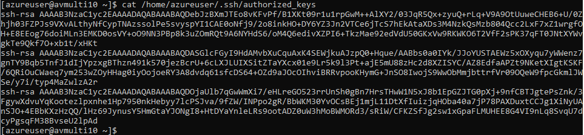

# Linux VM with multiple SSH public keys
This simple example shows how to deploy an Azure VM with multiple SSH public keys.

NOTE: This approach works properly with CentOS 7.4 images, but only stores the last key for CentOS 6.8 images. The issue in CentOS 6.8 image is caused by an issue in WALinuxAgent where [Redhat6xOSUtil.openssl_to_openssh()](https://github.com/Azure/WALinuxAgent/blob/0c5add75646c2f975c7f8dccc1c15e43618e0e4b/azurelinuxagent/common/osutil/redhat.py#L64) is using fileutil.write_file() instead of fileutil.append_file(). There is a pull request that fixes the issue https://github.com/Azure/WALinuxAgent/pull/1349/files

Create resource group for the VM(s)
```
az group create --name avmulti1 --location eastus2
```

Generate three SSH key-pairs on Linux or Windows Subsystem for Linux https://docs.microsoft.com/en-us/azure/virtual-machines/linux/mac-create-ssh-keys
```
ssh-keygen -t rsa -b 2048 -N "" -f sshKey1
ssh-keygen -t rsa -b 2048 -N "" -f sshKey2
ssh-keygen -t rsa -b 2048 -N "" -f sshKey3
```

Load three SSH public keys into environment variables
```
export sshPublicKey1=$(cat sshKey1.pub)
export sshPublicKey2=$(cat sshKey2.pub)
export sshPublicKey3=$(cat sshKey3.pub)
```

Deploy VM with three SSH public keys
```
az group deployment create --resource-group avmulti1 --template-file create-vm-with-multiple-ssh-keys.json --parameters sshPublicKey1="$sshPublicKey1" sshPublicKey2="$sshPublicKey2" sshPublicKey3="$sshPublicKey3"
```

Get VM public IP address
```
az vm list-ip-addresses --resource-group avmulti1
```

SSH into the VM
```
sudo ssh azureuser@VM_PUBLIC_IP_ADDRESS -i sshKey1
```

Check contents of the authorized_keys file
```
cat /home/azureuser/.ssh/authorized_keys
```

