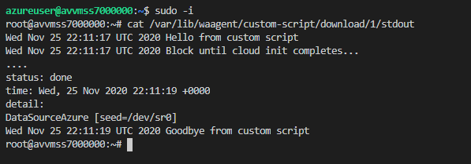

# Azure VMSS with cloud-init and Custom Script Extension

Example of a simple template that deploys VMSS using Canonical Ubunut 16.04-LTS image, uses cloud-init for provisioning, and waagent for Microsoft.Azure.Extensions CustomScript extension.

> WARNING: For simplicity, this template creates VMSS with Public IP and SSH access that is open to the Internet. Use only for testing and delete VMSS after deployment.

> IMPORTANT: When building your Azure Application ARM templates for submission to Azure Marketplace, please make sure to carefully follow all of the guidelines and practices described [here](https://github.com/Azure/azure-quickstart-templates/blob/master/1-CONTRIBUTION-GUIDE/best-practices.md) and be ready to make fixes and changes based on [manual review feedback](https://docs.microsoft.com/en-us/azure/marketplace/partner-center-portal/azure-apps-review-feedback).

Test the application using <http://github.com/Azure/arm-ttk> tool

```cmd
C:\Code\GitHub\Azure\arm-ttk\arm-ttk\Test-AzTemplate.cmd
```

Get container-level SAS URL with read/write permissions for Azure Storage account

```bash
az storage container generate-sas --account-name {YOUR_STORAGE_ACCOUNT} --name {YOUR_CONTAINER} --permissions racwdl --expiry "2020-12-01T00:00:00Z"
```

Upload local template and scripts to Azure Storage using the container-level SAS URL

```bash
azcopy cp * "https://{YOUR_STORAGE_ACCOUNT}.blob.core.windows.net/{YOUR_CONTAINER}?{SAS_WITH_READ_WRITE_AT_CONTAINER_LEVEL}" --recursive
```

Create resource group and deploy using the templates and scripts in the storage account

```bash
az group create --name avvmss1 --location eastus2

az deployment group create --resource-group avvmss1 --template-uri "https://{YOUR_STORAGE_ACCOUNT}.blob.core.windows.net/{YOUR_CONTAINER}/mainTemplate.json?{SAS_WITH_READ_WRITE_AT_CONTAINER_LEVEL}" --parameter _artifactsLocationSasToken="?{SAS_WITH_READ_WRITE_AT_CONTAINER_LEVEL}"

az vmss list-instance-public-ips --resource-group avvmss1 --name avvmss1
```

SSH into the VMSS node

```bash
ssh azure@{PUBLIC_IP_OF_VMSS_INSTANCE}
```

Check result of runcmd that ran within cloud-init

```text
root@avvmss7000000:~# cat /tmp/hello_from_cloud_init.txt
Hello from cloud-init!
```

Check standard output from custom script

```bash
sudo -i
cat /var/lib/waagent/custom-script/download/1/stdout
```



Check cloud-init log and outputs

```bash
sudo -i
cat /var/log/cloud-init.log
cat /var/log/cloud-init-output.log
```

## waagent info

Version

```text
azureuser@avvmss1000000:~$ waagent version
WALinuxAgent-2.2.45 running on ubuntu 16.04
Python: 3.5.2
Goal state agent: 2.2.52
```

Contents of /etc/waagent.conf [samples/waagent.conf](samples/waagent.conf)

## cloud-init info

Version

```text
azureuser@avvmss1000000:~$ cloud-init --version
/usr/bin/cloud-init 20.3-2-g371b392c-0ubuntu1~16.04.1
```

Contents of cloud-init config passed via base64 encoded customData to the VMSS [samples/cloud-init.txt](samples/cloud-init.txt)
